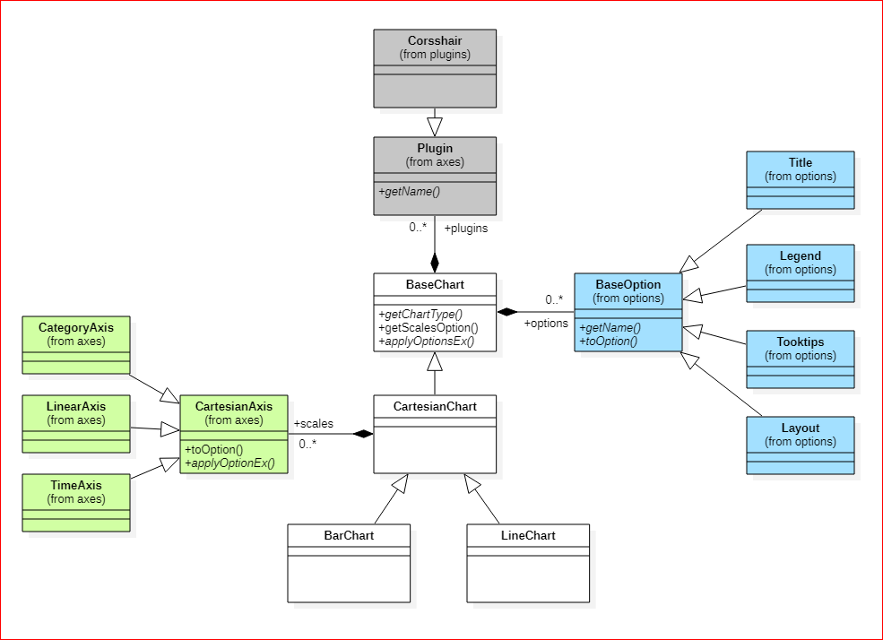

Design Concept
===

## Description
Because the control is a wrapper of Chart.js, the design pattern will refer to the original concept of Chart.js as much as possible. 

If you know Chart.js well, you will understand the control quickly.

### Chart.js to OpenUI5
The below structure is core model of Chart.js 
```js
{
  type: "bar",    // bar, line ...
  data: {
    labels: [],
    datasets: [],
  },
  options: {
    animation: {},
    layout: {},
    legend: {},
    plugins: {},
    title: {},
    tooltips: {},
    scales: []
  },
  plugins: []
}
```
1. The `type` of attribute maps to `ui5.chartjs` namespace.

    * __line__ - ui5.chartjs.LineChart
    * __bar__ - ui5.chartjs.BarChart


2. The values of `data.datasets` are objects of dataset which maps to `ui5.chartjs.data` namespace.

    * __line__ - ui5.chartjs.data.Line
    * __bar__ - ui5.chartjs.data.Bar


3. The `options` of attribute maps to `ui5.chartjs.options` namespace.

    * __animation__ - ui5.chartjs.options.Animation
    * __layout__ - ui5.chartjs.options.Layout
    * __legend__ - ui5.chartjs.options.Legend
    * __plugins__ - _ui5.chartjs.plugins.*_
    * __title__ - ui5.chartjs.options.Title
    * __tooltips__ - ui5.chartjs.options.Tooltips
    * __scales__ - _ui5.chartjs.axes.*_


4. The values of `options.scales` are objects of axis which map to `ui5.chartjs.axes` namespace.

    * __Category__ - ui5.chartjs.axes.CategoryAxis
    * __Linear__ - ui5.chartjs.axes.LinearAxis
    * Logarithmic - TBD
    * __Time__ - ui5.chartjs.axes.TimeAxis


5. The values of `options.plugins` are configuration of plugins which map to `ui5.chartjs.plugins` namespace.

    * __Crosshair__ - [chartjs-plugin-crosshair](https://www.npmjs.com/package/chartjs-plugin-crosshair) UI5 version

    * __StepLine__ - draw horizontal lines on the chart.

Based on the concept above, the class diagram is



## Datasets
All datasets have following common attributes:

* label
* data
* xAxisID
* yAxisID

### Bar
```xml
<chartjs:BarChart>
    <chartjs:datasets>
        <data:Bar />
    </chartjs:dataset>
</chartjs:LineChart>
```
The configuration of chart.js is `type='bar'`

The implementation is `ui5.chartjs.data.Bar`

### Line
```xml
<chartjs:LineChart>
    <chartjs:datasets>
        <data:Line />
    </chartjs:dataset>
</chartjs:LineChart>
```
The configuration of chart.js is `type='line'`

The implementation is `ui5.chartjs.data.Line`

## ui5.chartjs.options

```xml
<chartjs:options>
    <opts:Animation />
    <opts:Layout />
    <opts:Legend />
    <opts:Title />
    <opts:Tooltips />
</chartjs:options>
```

All implementations map to the `options` of chart.js.

### Animation
The configuration of chart.js is `options.animation`

The implementation is `ui5.chartjs.options.Animation`

### Layout
The configuration of chart.js is `options.layout`

The implementation is `ui5.chartjs.options.Layout`

* paddingLeft
* paddingRight
* paddingTop
* paddingBottom

### Legend
The configuration of chart.js is `options.legend`

The implementation is `ui5.chartjs.options.Legend`.

* display
* position
* fullWidth
* align
* reserve
* right2Left

### Title
The configuration of chart.js is `options.title`

The implementation is `ui5.chartjs.options.Title`.

* display
* position
* fontSize
* fontFamily
* fontColor
* fontStyle
* padding
* lineHeight
* text

### Tooltips
The configuration of chart.js is `options.tooltips`

The implementation is `ui5.chartjs.options.Tooltips`.

## ui5.chartjs.axes
```xml
<chartjs:scales>
    <axes:CategoryAxis />
    <axes:LinearAxis />
    <axes:Logarithmic />
    <axes:TimeAxis />
</chartjs:scales>
```

There are 4 types of axis implementation for `options.scales` of chart.js. All axes have following common attributes:

* axisID
* display
* position
* offset
* weight
* title
* titleDisplay
* titleLineHeight
* titleFontColor
* titleFontFamily
* titleFontStyle

### CategoryAxis
The implementation is `ui5.chartjs.axes.CategoryAxis`.

* max
* min

### LinearAxis
The implementation is `ui5.chartjs.axes.LinearAxis`.

* beginAtZero
* maxTicksLimit
* precision
* stepSize
* max
* min
* suggestedMax
* suggestedMin

### Logarithmic
TBD

### TimeAxis
The implementation is `ui5.chartjs.axes.TimeAxis`.

* displayFormat
* isoWeekday
* parser
* round
* tooltipFormat
* unit
* minUnit

## Plugins

All are implemented for `plugins` of chart.js.

### Crosshair
```xml
<chartjs:plugins>
    <plugins:Crosshair>
        <plugins:PluginAttr key="sync" value="true" />
    </plugins:Crosshair>
</chartjs:options>
```
The implementation is `ui5.chartjs.plugins.Crosshair` which wraps the [chartjs-plugin-crosshair](https://www.npmjs.com/package/chartjs-plugin-crosshair).

Known issue:
1. The x-axis must be __LinearAxis__ or  __TimeAxis__, or the chart will throw the exception.

### StepLine
```xml
<chartjs:plugins>
    <stepline:StepLine>
        <stepline:StepInfo
            name="target"
            value="24.6"
            lineColor="rgba(255,0,0,1)" />
    </stepline:StepLine>
</chartjs:options>
```

The implementation is `ui5.chartjs.plugins.stepline.StepLine`.


## Remark
Namespace References
```xml
<mvc:View
        controllerName="..."
        ...
        xmlns:chartjs="ui5.chartjs"
        xmlns:data="ui5.chartjs.data"
        xmlns:opts="ui5.chartjs.options"
        xmlns:plugins="ui5.chartjs.plugins"
        xmlns:specline="ui5.chartjs.plugins.specline"
        xmlns:axes="ui5.chartjs.axes">
</mvc:View>
```