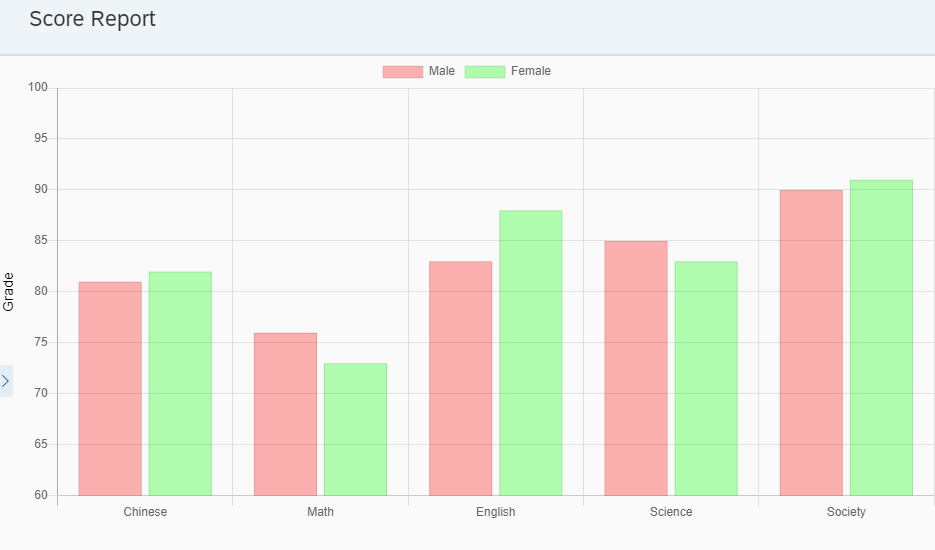
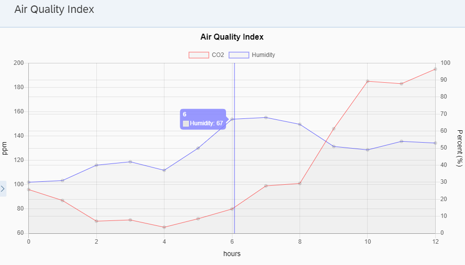

Chart.js for OpenUI 5
===
## Description
The goal of this project is to create a UI5 library based on [Chart.js](https://www.chartjs.org/), which has the same model as Chart.js.

The main reasons to make the model as same as Chart.js are:

* You can use this library by referring to the Chart.js documentation.
* You can modify this library easily to make it compatible with the last update of Chart.js version 2.

The current implementation includes only BarChart and LineChart.

The resources of Chart.js

* [Documents](https://www.chartjs.org/docs/latest/)
* [Samples](https://www.chartjs.org/samples/latest/)
* [Popular Extensions](https://www.chartjs.org/docs/2.7.2/notes/extensions.html)


## How to Build
1. __npm install__ - install dependency packages.

2. __npm run prepare__ - prepare dev environment.

3. __npm run start__ - demo the samples.

4. __npm run build__ - build and output to `dist` folder.


## How to Use

1. Copy library to the `resources` folder of your project. THe full path will be like: `{WORK_DIR}/resources/ui5/chartjs/`.

2. setup __index.html__ where the library is.
   
    ```html
    <script
      data-sap-ui-resourceroots='{
        ...,
        "ui5.chartjs": "./resources/ui5/chartjs/"
      }'>
    </script>
    ```

3. add a line chart.
    ```xml
    <mvc:View
            controllerName="your.controller.Name"
            xmlns:m="sap.m"
            xmlns:mvc="sap.ui.core.mvc"
            xmlns:l="sap.ui.layout"
            xmlns:chartjs="ui5.chartjs"
            xmlns:data="ui5.chartjs.data">
        <m:Page showHeader="false">
            <chartjs:LineChart datasets="{/result}">
                <data:Line
                        label="{name}"
                        data="{points}"
                        borderColor="{color}" />
            </chartjs:LineChart>
        </m:Page>
    </mvc:View>   
    ```

4. prepare datasets to display.
    ```json
    var result = [
      {
        "name": "name1",
        "points": [
          { "x": 1, "y": 10.3 },
          { "x": 2, "y": 10.9 },
          { "x": 3, "y": 11.1 },
          { "x": 4, "y": 10.7 }],
        "color": "rgba(255, 255, 0, 0.6)"
      },
      {
        "name": "name2",
        "points": [
          { "x": 1, "y": 32.9 },
          { "x": 2, "y": 31.1 },
          { "x": 3, "y": 30.8 },
          { "x": 4, "y": 31.4 }],
        "color": "rgba(255, 0, 255, 0.6)"
      }
    ]
    ```


## Step By Step

* [Line Chart](SBS_LINE.md)
* [BAR Chart](SBS_BAR.md)
* [Events](SBS_EVENTS.md)
* [Plugins](SBS_PLUGINS.md)

## Develop

Reference [Design](DESIGN.md) document.


## Some Samples
### BarChart


``` xml
<chartjs:BarChart
      datasets="{/testResults}">
  <data:Bar
      label="{label}"
      yAxisID="score"
      data="{scores}"
      backgroundColor="{color}" />
  <chartjs:scales>
    <axes:LinearAxis
        axisID="score"
        position="left"
        title="Scores"
        suggestedMax="100.0"
        suggestedMin="60.0">
      <axes:GridLines display="true" />
    </axes:LinearAxis>
  </chartjs:scales>
</chartjs:BarChart>
```

### LineChart


```xml
<chartjs:LineChart>
  <chartjs:options>
    <options:Title
        text="Air Quality Index"
        fontSize="16" />
    <options:Tooltips
        backgroundColor="rgba(128,128,255,0.8)" />
  </chartjs:options>
  <chartjs:plugins>
    <plugins:Crosshair>
      <plugins:PluginAttr
          key="sync"
          value="true" />
    </plugins:Plugin>
  </chartjs:plugins>
  <chartjs:scales>
    <axes:LinearAxis
        axisID="hours"
        position="bottom"
        title="hours"
        titleDisplay="true">
      <axes:GridLines display="true" />
    </axes:LinearAxis>
    <axes:LinearAxis
        axisID="ppm"
        position="left"
        title="ppm"
        titleDisplay="true">
      <axes:GridLines display="true" />
    </axes:LinearAxis>
    <axes:LinearAxis
        axisID="percent"
        position="right"
        titleDisplay="true"
        title="Percent (%)"
        suggestedMax="100.0"
        beginAtZero="true">
      <axes:GridLines display="true" />
    </axes:LinearAxis>
  </chartjs:scales>
</chartjs:LineChart>
```

## References

* [Chart.js](https://www.chartjs.org/)
* [UI5 Custom Library Template](https://github.com/UI5Lab/UI5Lab-library-simple)

## Copyright and License

Licensed under the Apache License, Version 2.0 (the "License");
you may not use this file except in compliance with the License.
You may obtain a copy of the License at

[http://www.apache.org/licenses/LICENSE-2.0](http://www.apache.org/licenses/LICENSE-2.0)

Unless required by applicable law or agreed to in writing, software
distributed under the License is distributed on an "AS IS" BASIS,
WITHOUT WARRANTIES OR CONDITIONS OF ANY KIND, either express or implied.
See the License for the specific language governing permissions and
limitations under the License.
