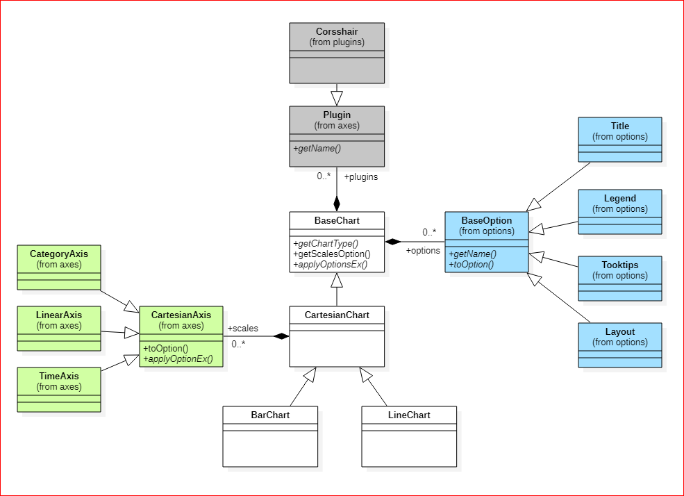

Chart.js for OpenUI 5
===
## Description
The goal of this poject is to create a UI5 library based on [Chart.js](https://www.chartjs.org/), which has the same model as Chart.js.

The main reasons to make the model as same as Chart.js are:

* You can use this library by referring to the Chart.js documentation.
* You can modify this library easily to make it compatible with the last update of Chart.js version 2.

The current implementation includes only BarChart and LineChart.

The resources of Chart.js

* [Documents](https://www.chartjs.org/docs/latest/)
* [Samples](https://www.chartjs.org/samples/latest/)
* [Popular Extensions](https://www.chartjs.org/docs/2.7.2/notes/extensions.html)


## How to Use
### Build
1. __npm install__

2. __npm start__ - demo the samples.

3. __npm run build__ - build and output to `dist` folder.

### Integrated in the Poject
1. __index.html__ - add the libray.
  ```html
  <script
      data-sap-ui-resourceroots='{
          ...,
          "uia.chartjs": "./js/uia-chartjs/resource/uia/chartjs/"
      }'>
  </script>
  ```

2. __view.xml__ - use the chart control.
  ```xml
  <mvc:View
          controllerName="your.ControllerName"
          xmlns:mvc="sap.ui.core.mvc"
          xmlns:chartjs="uia.chartjs"
          xmlns:options="uia.chartjs.options"
          xmlns:axes="uia.chartjs.axes">
      ...
      <chartjs:LineChart>
          <options:Title
                text="history" />
          <chartjs:scales>
              <axes:CategoryAxis
                      axisID="x"
                      position="bottom"
                      title="time" />
              <axes:LinearAxis
                      axisID="y1"
                      position="left"
                      title="values" />
          </chartjs:scales>
      </chartjs:LineChart>
      ...
  </mvc:View>
```

## Main Design Concept
The core model of Chart.js is
```js
{
    type: "bar",    // bar, line ...
    data: {
        labels: [],
        datasets: [],
    },
    options: {
        animation: {},
        layout: {},
        legend: {},
        plugins: {},
        title: {},
        tooltips: {},
        scales: []
    },
    plugins: []
}
```
1. The `type` of attribute maps to `uia.chartjs` namespace.

  * __line__ - uia.chartjs.LineChart
  * __bar__ - uia.chartjs.BarChart


2. The values of `data.datasets` are objects of dataset which maps to `uia.chartjs.data` namespace.

  * __line__ - uia.chartjs.data.Line
  * __bar__ - uia.chartjs.data.Bar


3. The `options` of attribute maps to `uia.chartjs.options` namespace.

  * animation - TBD
  * __layout__ - uia.chartjs.options.Layout
  * __legend__ - uia.chartjs.options.Legend
  * __plugins__ - _uia.chartjs.plugins.*_
  * __title__ - uia.chartjs.options.Title
  * __tooltips__ - uia.chartjs.options.Tooltips
  * __scales__ - _uia.chartjs.axes.*_


4. The values of `options.scales` are objects of axis which map to `uia.chartjs.axes` namespace.

  * __Category__ - uia.chartjs.axes.CategoryAxis
  * __Linear__ - uia.chartjs.axes.LinearAxis
  * Logarithmic - TBD
  * __Time__ - uia.chartjs.axes.TimeAxis


5. The values of `options.plugins` are configurtion of plugins which map to `uia.chartjs.plugins` namespace.

  * __Crosshair__ - [chartjs-plugin-crosshair](https://www.npmjs.com/package/chartjs-plugin-crosshair) UI5 version

Based on the concept above, the class diagram is



### data.datasets
All datasets have following common attributes:

* label
* data
* xAxisID
* yAxisID

#### Bar
The implementation is `uia.chartjs.data.Bar`

#### Line
The implementation is `uia.chartjs.data.Line`

### options
#### options.layout
The implementation is `uia.chartjs.options.Layout`

  * paddingLeft
  * paddingRight
  * paddingTop
  * paddingBottom

#### options.legend
The implementation is `uia.chartjs.options.Legend`.

* display
* position
* fullWidth
* align
* reserve
* right2Left

#### options.title
The implementation is `uia.chartjs.options.Title`.

* display
* position
* fontSize
* fontFamily
* fontColor
* fontStyle
* padding
* lineHeight
* text

#### options.Tooltips
The implementation is `uia.chartjs.options.Tooltips`.

### options.scales
There are 4 types of axis implementation for `options.scales`. All axes have following common attributes:

* axisID
* display
* position
* offset
* weight
* title
* titleDisplay
* titleLineHeight
* titleFontColor
* titleFontFamily
* titleFontStyle

#### CategoryAxis
The implementation is `uia.chartjs.axes.CategoryAxis`.

* max
* min

#### LinearAxis
The implementation is `uia.chartjs.axes.LinearAxis`.

* beginAtZero
* maxTicksLimit
* precision
* stepSize
* max
* min
* suggestedMax
* suggestedMin

#### Logarithmic
TBD

#### TimeAxis
The implementation is `uia.chartjs.axes.TimeAxis`.

* displayFormat
* isoWeekday
* parser
* round
* tooltipFormat
* unit
* minUnit

### options.plugins

#### Crosshair
The plugin wraps the [chartjs-plugin-crosshair](https://www.npmjs.com/package/chartjs-plugin-crosshair).

Known issue:
1. The x-axis must be __LinearAxis__ or  __TimeAxis__, or the chart will throw the exception.

XML sample:
```xml
<plugins:Corsshair>
    <plugins:PluginAttr key="sync" value="true" />
</plugins:Corsshair>
```


## Samples
### BarChart


``` xml
<chartjs:BarChart>
    <options:Title text="Grade" />
    <options:Legend display="true" />
    <chartjs:data>
        <data:Bar
                lebel="Male"
                xAxisID="grade"
                data="{/male/data}"
                backgroundColor="rgba(255,0,0,0.3)" />
        <data:Bar
                lebel="Female"
                xAxisID="grade"
                data="{/female/data}"
                backgroundColor="rgba(0,255,0.3)" />
    </chartjs:data>
    <chartjs:scales>
        <axes:LinearAxis
                axisID="grade"
                position="left"
                title="Grade"
                suggestedMax="100.0"
                suggestedMin="60.0">
            <axes:GridLines display="true" />
        </axes:LinearAxis>
    </chartjs:scales>
</chartjs:BarChart>
```

### LineChart


```xml
<chartjs:LineChart>
    <options:Title
            text="Air Quality Index"
            fontSize="16" />
    <options:Tooltips
            backgroundColor="rgba(128,128,255,0.8)" />
    <chartjs:plugins>
        <plugins:Crosshair>
            <plugins:PluginAttr
                key="sync"
                value="true" />
        </plugins:Plugin>
    <chartjs:plugins>
    <chartjs:scales>
        <axes:LinearAxis
                axisID="hours"
                position="bottom"
                title="hours"
                titleDisplay="true">
            <axes:GridLines display="true" />
        </axes:LinearAxis>
        <axes:LinearAxis
                axisID="ppm"
                position="left"
                title="ppm"
                titleDisplay="true">
            <axes:GridLines display="true" />
        </axes:LinearAxis>
        <axes:LinearAxis
                axisID="percent"
                position="right"
                titleDisplay="true"
                title="Percent (%)"
                suggestedMax="100.0"
                beginAtZero="true">
            <axes:GridLines display="true" />
        </axes:LinearAxis>
    </chartjs:scales>
</chartjs:LineChart>
```

## References

* [Chart.js](https://www.chartjs.org/)
* [UI5 Custom Library Template](https://github.com/UI5Lab/UI5Lab-library-simple)

## Copyright and License

Licensed under the Apache License, Version 2.0 (the "License");
you may not use this file except in compliance with the License.
You may obtain a copy of the License at

[http://www.apache.org/licenses/LICENSE-2.0](http://www.apache.org/licenses/LICENSE-2.0)

Unless required by applicable law or agreed to in writing, software
distributed under the License is distributed on an "AS IS" BASIS,
WITHOUT WARRANTIES OR CONDITIONS OF ANY KIND, either express or implied.
See the License for the specific language governing permissions and
limitations under the License.
