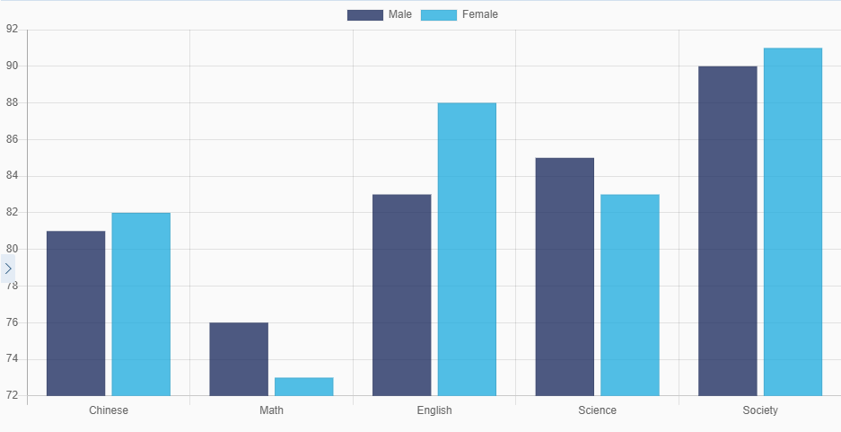

Bar Chart
===

## Abstract

The XML structure will likes

```xml
<chartjs:BarChart>
    <chartjs:datasets>
        <data:Bar />
    </chartjs:datasets>
    <chartjs:options>
        <opts:Animation />
        <opts:Layout />
        <opts:Legend />
        <opts:Title />
        <opts:Tooltips />
    </chartjs:options>
    <chartjs:scales>
        <axes:CategoryAxis />
        <axes:LinearAxis />
    </chartjs:scales>
    <chartjs:plugins />
</chartjs:BarChart>
```


## Step by Step
### view.xml
1. Create a empty bar chart with labels of subjects.
    ```xml
    <chartjs:BarChart labels="{/subjects}">
    </chartjs:BarChart>
    ```

2. add two datasets and reference to `value` axes.
    ```xml
    <data:Bar
            label="Male"
            data="{/male/score}"
            yAxisID="score"
            backgroundColor="{/male/color}" />
    <data:Bar
            label="Female"
            data="{/female/score}"
            yAxisID="score"
            backgroundColor="{/female/color}" />
    ```

Full XML
```xml
<mvc:View
        controllerName="my.SampleChart"
        xmlns:m="sap.m"
        xmlns:mvc="sap.ui.core.mvc"
        xmlns:chartjs="ui5.chartjs"
        xmlns:data="ui5.chartjs.data">
    <m:Page showHeader="false">
        <chartjs:BarChart
                labels="{/subjects}">
            <data:Bar
                    label="Male"
                    data="{/male/score}"
                    yAxisID="score"
                    backgroundColor="{/male/color}" />
            <data:Bar
                    label="Female"
                    data="{/female/score}"
                    yAxisID="score"
                    backgroundColor="{/female/color}" />
        </chartjs:BarChart>
    </m:Page>
</mvc:View>
```

### JSONModel
The datasets bind to the chart above are
```js
var result = {
    "subjects": [ "Chinese", "Math", "English", "Science", "Society" ],
    "male": {
        "score": [ 81, 76, 83, 85, 90 ],
        "color": ui5.chartjs.Palette.pick(0, 192)
    },
    "female": {
        "score": [ 82, 73, 88, 83, 91 ],
        "color": ui5.chartjs.Palette.pick(2, 192)
    }
]
```

### Result
The output line chart will be

 


