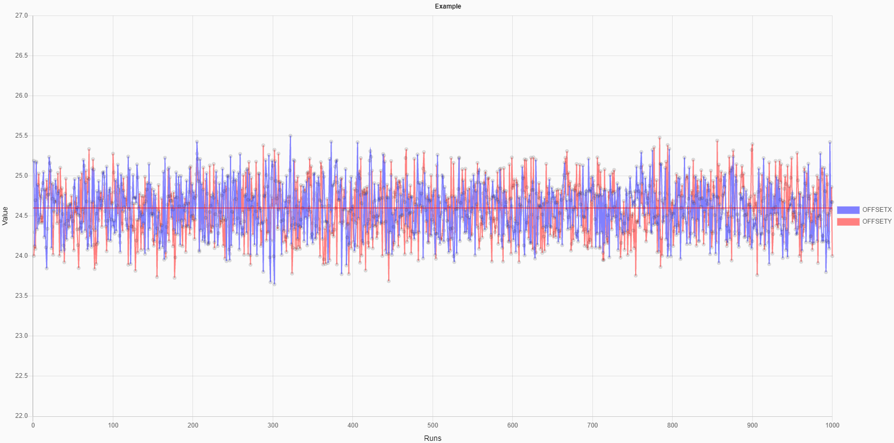

Line Chart
===

## Abstract

The XML structure will likes

```xml
<chartjs:LineChart>
    <chartjs:datasets>
        <data:Line />
    </chartjs:datasets>
    <chartjs:options>
        <opts:Animation />
        <opts:Layout />
        <opts:Legend />
        <opts:Title />
        <opts:Tooltips />
    </chartjs:options>
    <chartjs:scales>
        <axes:LinearAxis />
    </chartjs:scales>
    <chartjs:plugins />
</chartjs:LineChart>
```


## Step by Step
### view.xml
1. Create a empty line chart.
    ```xml
    <chartjs:LineChart>
    </chartjs:LineChart>
    ```

2. Add a title and place a legend at right side.
    ```xml
    <chartjs:options>
        <opts:Title text="Example" />
        <opts:Legend position="right" />
    </chartjs:options>
    ```

3. Add a linear X axis named `run_seq` at bottom.
    ```xml
    <chartjs:scales>
        <axes:LinearAxis
                axisID="run_seq"
                title="Runs"
                display="true"
                position="bottom">
        </axes:LinearAxis>
    </chartjs:scales>
    ```

4. Add a linear Y axis named `value` at left side, max is `27`, min is `22`.
    ```xml
    <chartjs:scales>
        <axes:LinearAxis
                axisID="value"
                title="Value"
                display="true"
                suggestedMax="27"
                suggestedMin="22"
                position="left" />
    </chartjs:scales>
    ```

5. add a dataset and references to `run_seq` and  `value` axes.
    ```xml
    <data:Line
            label="{/name}"
            data="{/points}"
            xAxisID="run_seq"
            yAxisID="value"
            borderColor="{/color}" />
    ```

6. add a `SpecLine` plugin to draw a horizontal `red` line at `24.6` of Y axis.
    ```xml
    <chartjs:plugins>
        <specline:SpecLine>
            <specline:specInfos>
                <specline:SpecInfo
                        name="target"
                        value="24.6"
                        lineColor="rgba(255,0,0,1)" />
            </specline:specInfos>
        </specline:SpecLine>
    </chartjs:plugins>
    ```

Full XML
```xml
<mvc:View
        controllerName="my.SampleChart"
        xmlns:m="sap.m"
        xmlns:mvc="sap.ui.core.mvc"
        xmlns:chartjs="uia.chartjs"
        xmlns:data="uia.chartjs.data"
        xmlns:opts="uia.chartjs.options"
        xmlns:specline="uia.chartjs.plugins.specline"
        xmlns:axes="uia.chartjs.axes">
    <m:Page showHeader="false">
        <chartjs:LineChart datasets="{/result}">
            <chartjs:options>
                <opts:Title text="Example" />
                <opts:Legend position="right" />
            </chartjs:options>
            <chartjs:scales>
                <axes:LinearAxis
                        axisID="run_seq"
                        title="Runs"
                        display="true"
                        position="bottom" />
                <axes:LinearAxis
                        axisID="value"
                        title="Value"
                        display="true"
                        suggestedMax="27"
                        suggestedMin="22"
                        position="left" />
            </chartjs:scales>
            <data:Line
                    label="{name}"
                    data="{points}"
                    xAxisID="run_seq"
                    yAxisID="value"
                    borderColor="{color}" />
            <chartjs:plugins>
                <specline:SpecLine>
                    <specline:specInfos>
                        <specline:SpecInfo
                                name="target"
                                value="24.6"
                                lineColor="rgba(255,0,0,1)" />
                    </specline:specInfos>
                </specline:SpecLine>
            </chartjs:plugins>
        </chartjs:LineChart>
    </m:Page>
</mvc:View>
```

### JSONModel
The datasets bind to the chart above are
```js
var result = [
    {
        "name": "OFFSETX",
        "points": [ { "x":1, "y":24.3 }, .... ],
        "color": "rgba(128,128,255,0.6)"
    },
    {
        "name": "OFFSETY",
        "points": [ { "x":1, "y":25.1 }, .... ],
        "color": "rgba(255,128,128,0.6)"
    }
]
```

### Result
The output line chart will be

 

