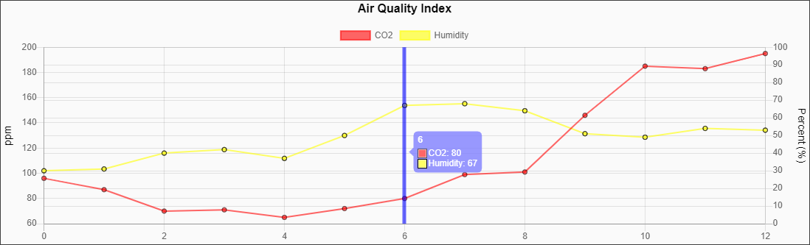
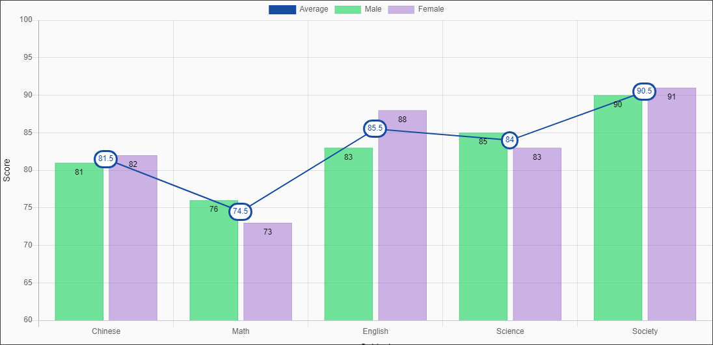
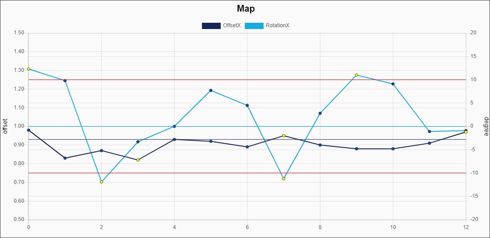

Plugins
===

## Crosshair (Wrapper)

[github](https://www.npmjs.com/package/chartjs-plugin-crosshair)



* UI5 namespace: `xmlns:plugins="ui5.chartjs.plugins"`
* Class: `ui5.chartjs.plugins.Crosshair`

### View
```xml
<chartjs:LineChart>
    <chartjs:plugins>
        <plugins:Crosshair>
            <plugins:PluginAttr
                    key="sync"
                    value="{ enabled:true }" />
            <plugins:PluginAttr
                    key="zoom"
                    value="{ enabled:false }" />
        </plugins:Crosshair>
    <chartjs:plugins>
</chartjs:LineChart>
```


## DataLabels (Wrapper)
[official](https://chartjs-plugin-datalabels.netlify.app/), [github](https://github.com/chartjs/chartjs-plugin-datalabels)


* UI5 namespace: `xmlns:specline="ui5.chartjs.plugins"`
* Class: `ui5.chartjs.plugins.specline.DataLabels`

### View
```xml
<chartjs:LineChart>
    <chartjs:plugins>
        <plugins:DataLabels>
        </plugins:DataLabels>
    <chartjs:plugins>
</chartjs:LineChart>
```


## SpecLine (New)



* UI5 namespace: `xmlns:specline="ui5.chartjs.plugins.specline"`
* Class: `ui5.chartjs.plugins.specline.SpecLine`

### View
```xml
<chartjs:LineChart>
    <chartjs:plugins>
        <specline:SpecLine>
            <specline:specInfos>
                <specline:SpecInfo
                        name="Target"
                        lineColor="rgba(0,0,255,1)"
                        value="100" />
                <specline:SpecInfo
                        name="UCL"
                        lineColor="rgba(255,0,0,1)"
                        value="110" />
                <specline:SpecInfo
                        name="LCL"
                        lineColor="rgba(255,0,0,1)"
                        value="90" />
            </specline:specInfos>
        </specline:SpecLine>
    <chartjs:plugins>
</chartjs:LineChart>
```


## Zoom (Wrapper)
[github](https://github.com/chartjs/chartjs-plugin-zoom)

* UI5 namespace: `xmlns:specline="ui5.chartjs.plugins"`
* Class: `ui5.chartjs.plugins.specline.Zoom`

### View
```xml
<chartjs:LineChart>
    <chartjs:plugins>
        <plugins:Zoom>
        </plugins:Zoom>
    <chartjs:plugins>
</chartjs:LineChart>
```
